# １．vs codeのインストール

以下に従って、vs codeをインストール  

[vs code インストール](https://www.javadrive.jp/vscode/install/index1.html)  

インストール画面に注意 特に以下は重要  
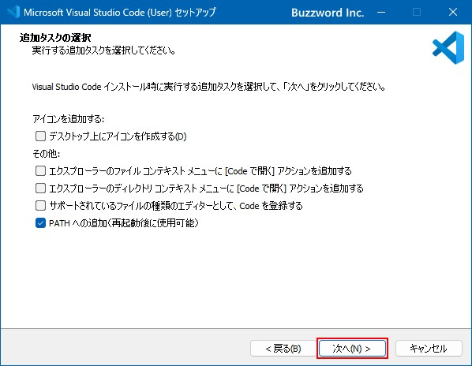

## 日本語化

インストール当初は、英語表示になっている。これを日本語化する
以下に従って日本語化してください。
（インストール済みの言語を切り替えて利用する　の前まで）
[日本語化](https://www.javadrive.jp/vscode/install/index4.html)

python 実行環境はデフォルトインストールされているはずだが
NGなら、上記と同様に拡張機能でpythonをインストール

# ２．vs codeでプログラミング

### １) vs code でプログラムを実行する

vs code **ファイルメニュー**から　**フォルダーを開く**　を選択して、各自のこの授業用のフォルダーに移動する。たどり着いたら　**フォルダーを選択**　をクリック

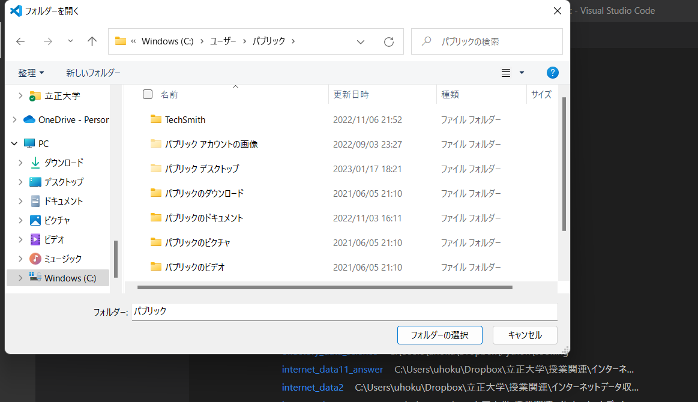

右のウインドウに教材一覧が表示されるので、プログラム detect_words.py をクリックすると以下のようにプログラムがメインウインドウに表示される

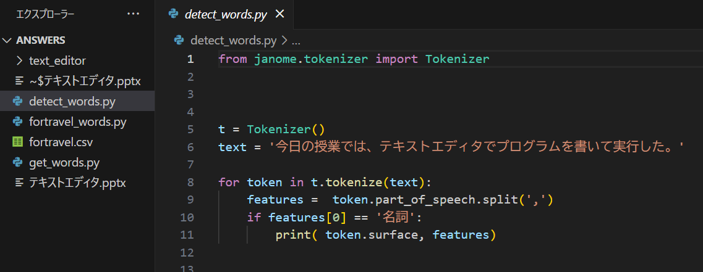

開いたら、まず　コマンドラインのウインドウ（右下）で

> pip install janome

次に**右上の矢印マークを押す**と、プログラムを実行できます.

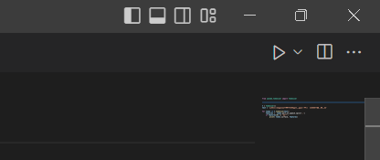

- fortravel_words.py   , get_words.pyを開いてください（実行するとエラーになるがこれは後で説明します）。

- **fortravel_words.pyの2行目に"from get_words import split_words" のように自前で作った関数"get_words.pyをブラックボックス化できていることに注目！**

#### ・複数のプログラムをタブとして同時に開くことができることがわかる

### 2) プログラムを修正する

 detect_words.py の変数 text をtestに修正してみてください。

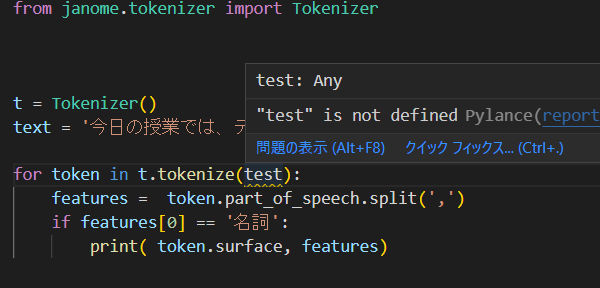

```python
for token in t.tokenize(text):  
    features =  token.part_of_speech.split(',')  
    if features[0] == '名詞':  
        print( token.surface, features)  
```

以下の通り、波線で警告される。マウスオーバーすると、この変数が定義されていないというメッセージが表示

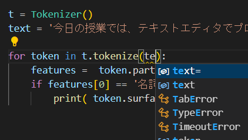

testを消して、te まで入力すると、先読みして候補を提示してくれる  
またtextと再度入力して、クリックすると参照関係にあるtext変数がハイライトされる


使わないモジュールをimportしてください。

```python
import  numpy as np
```

使わないモジュールはダークアウトされる

#### 3) 新規にプログラムを作成する

　　プログラムを新たに書くには以下の通り、ファイルメニューから　新しいテキストファイルを選択し　　名前を付けて保存　で適当にプログラム名をつけます。なお、拡張子は必ず.pyにすること。

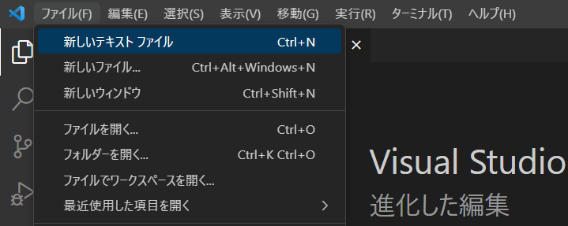

以下の表を2次元配列のリストで作成して、全要素の合計値を表示するプログラムを書いて実行してください。

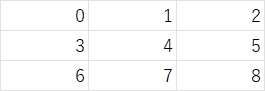

### 

# 3．デバッグ(1)

### 演習

#### １) バグのあるプログラムを実行する

　　fortravel_words.pyを実行してください。以下のようなエラーになるはず。エラーになった行番号が必ず出力されるので、該当コードの記述の間違いを考えて修正する

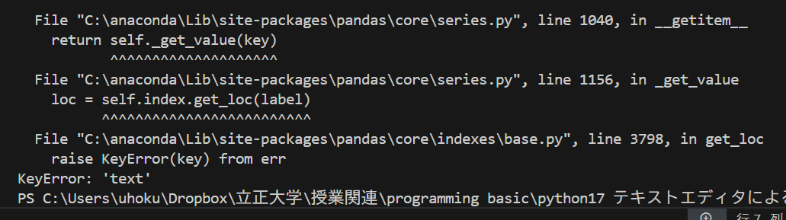

#### ２) 上記を修正して再度実行

　　これは、関数の中にバグがあるので、メインプログラムで関数を呼び出した行番号、および呼び出された関数中のエラーになった行番号が表示される。修正するべきところは、後者。バグを修正して再実行する。

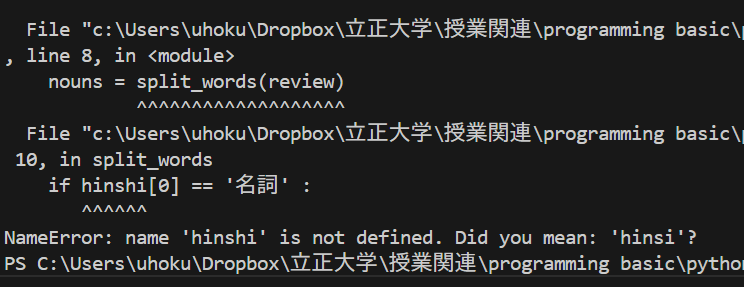

## 

# 4．論理バグを解決する

デバッガと呼ばれるツールで、プログラムの中間的な処理結果を1行づつ追いかけると
おかしなところが見つかる。

[参考サイト](https://qiita.com/jmsrsyunrinsyunki/items/f078b392e31b0c122392)

身長、体重を入力するとBMIを計算してBMI 値と評価コメントを出力するプログラム
[BMI](https://python.atelierkobato.com/bmi/)

```python
bmi_val, comment = bmi(170, 75)
>bmi: 25.95 アドバイス 前肥満です

bmi_val, comment = bmi(170, 90)
>bmi: 31.14 アドバイス 痩せ気味です　→　なんか変

bmi_val, comment = bmi(170, 110)
>bmi: 38.06 アドバイス 肥満（2度）です

bmi_val, comment = bmi(170, 50)
>bmi: 17.3 アドバイス 肥満（1度）です　→　なんか変
```

コードを見ると、if elseの煩雑な構文でどこがおかしいのか一見ではわかりにくい。そこで、
おかしな結果となっている個所にマークのようなもの（ブレークポイント）をつけて、
この処理結果がプログラム上でどのような経路をたどって得られているのかを追いかける。

以下のように操作してみてください。

### １)ブレークポイントの設定

おかしな処理結果となっている行　bmi_val, comment = bmi(170, 90)　の行番号の左脇
をクリックすると赤い〇をつけることができる。
この状態でデバッグモードで実行すると、プログラムはこの行の1つ手前で停止し、この行に
至る処理の過程を1行筒表示できるモードになる。
この〇で停止させるので、ブレークポイントと呼んでいる

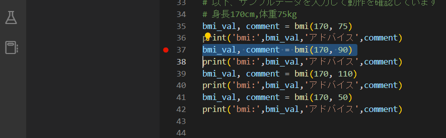

### ２)デバッグモードで実行

右上の実行ボタン（三角マーク）のプルダウンから　pythonファイルのデバッグ　を選択する

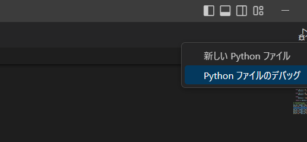

### ３)以下のようにブレークポイントで停止状態になる。また、右上のほうに、1行毎にプログラムを実行するためのボタンメニュー

が表示される

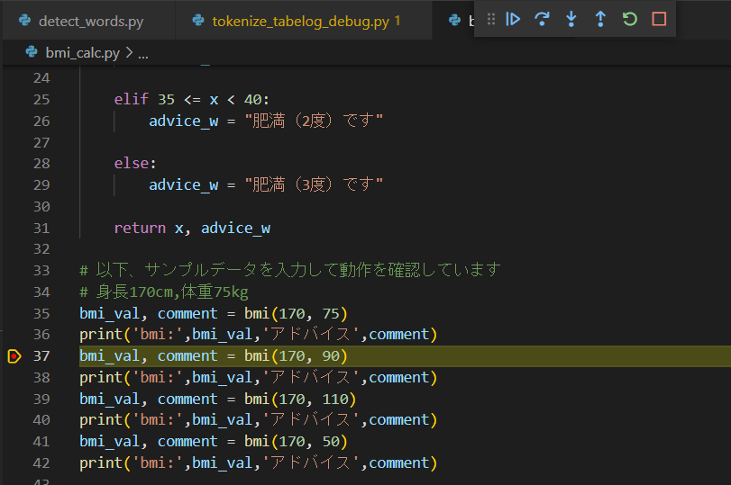

### ４) デバッグメニューをマウスオーバーすると、各ボタンの説明が表示される

下向き矢印は、関数の中身の処理を逐次表示するモード  

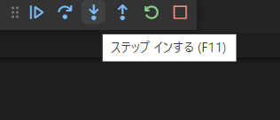  

### ５)ステップインしてみる

　　下向き矢印を1回押すと、関数の中にはいり、変数h,wに入っている値が表示される。ここまでは正しい模様

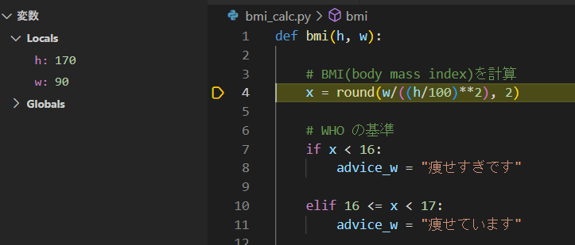

もう一度おすと、xの計算結果が表示される。これも問題なさそう  

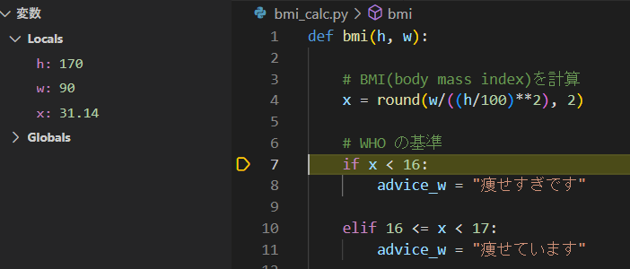  

　その後、何回か押すとif elifの条件文のところに停止して、インデントした中身には停止しない。つまり
　条件にあてはまってないことを意味する。
　以下の条件のみインデントの中身で停止する　ここがおかしなメッセージになっていることがわかる。

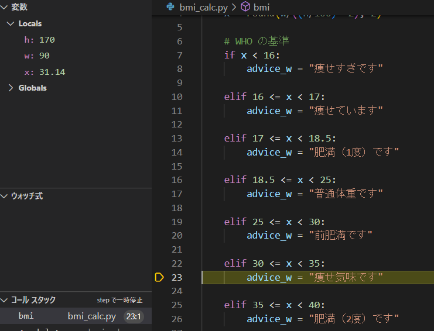

もう一度　押すと以下のようにadvice_wに入っている値を確認できる。つまり、ハイライトされた行の1つ手前の変数の状態
が左上のlocalsに表示される
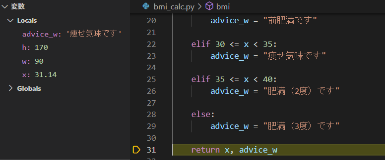

ちなみにステップオーバーは、関数を経由せずに次の処理に移って停止する（試してみてください）

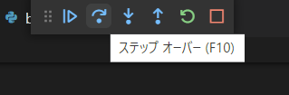

### ６) デバッグモードの終了

ブレークポイントを再度クリックするとポイントが消える
また、以下の■を押すとデバッグメニューが消える  

  
右上の実行ボタンをプルダウンして　新しいpython ファイル　を選択すると、通常の実行モードに戻る。  

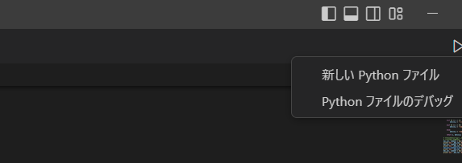