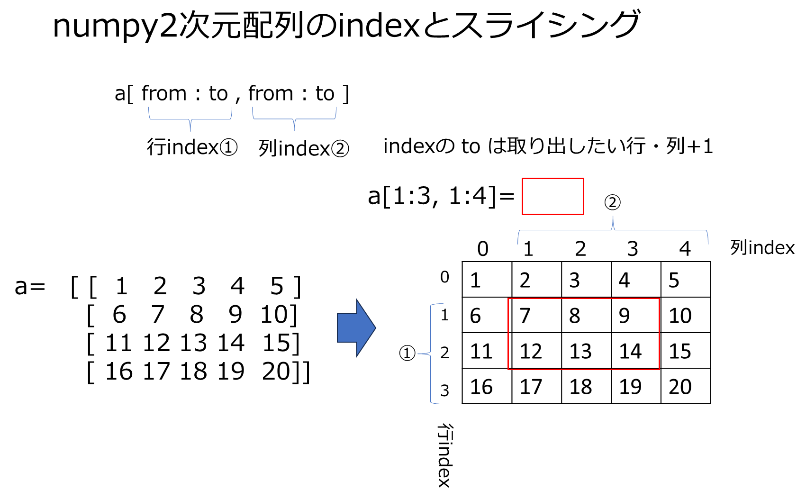
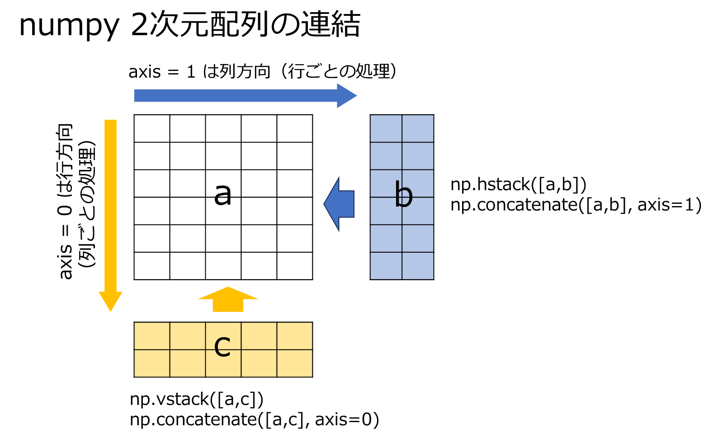
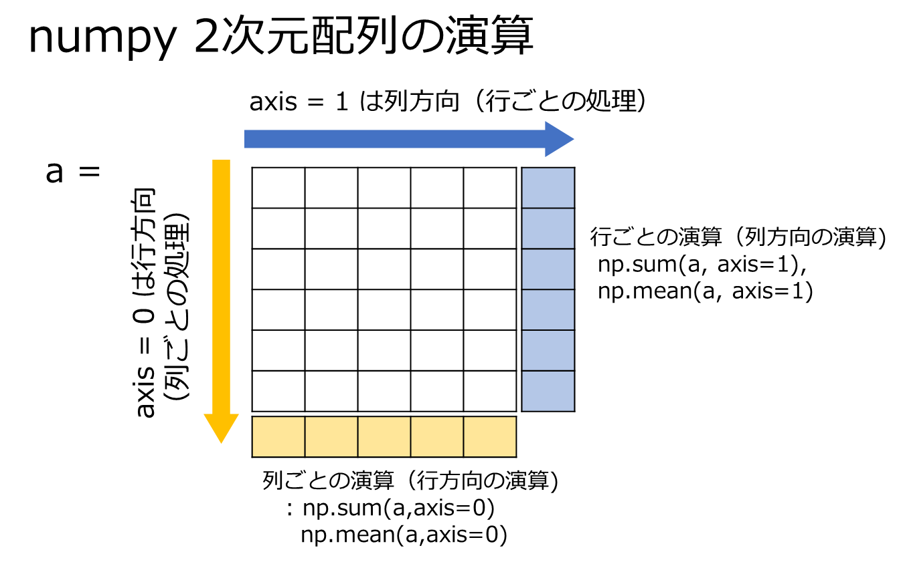

# numpy
1. numerical python 大規模な数値計算を高速に処理するための配列型
2. pythonでの大規模計算は例外なくnumpy型で実行する（ので大変重要）
3. 一見リスト型とよく似ているが、ブロードキャスト（後述）など、numpy独自な高速計算のための様々な仕組みが用意されている


```python
# 数値を要素とするnumpy型
import numpy as np
a = np.array([1.0,2.5,5.5])
print(a)
a = np.array([1.0,2.5,5.5+2])
print(a)
# 文字列を要素とするリスト型 - 要素に' '  " "をつけること
b = np.array(['a','f','t'])
print(b)
# 型の異なる要素の混在
c = np.array([2,'今日',5,'授業'])
print(c)
#変数を要素とする
a = 2
b = '今日'
c = np.array([a,b])
print(c)

```

    [1.  2.5 5.5]
    [1.  2.5 7.5]
    ['a' 'f' 't']
    ['2' '今日' '5' '授業']
    ['2' '今日']
    

### 1) 繰り返し


```python
a = np.zeros(10)
print(a)
b = np.ones(5)
print(b)
c = np.arange(10)
print(c)
```

    [0. 0. 0. 0. 0. 0. 0. 0. 0. 0.]
    [1. 1. 1. 1. 1.]
    [0 1 2 3 4 5 6 7 8 9]
    

### 2) 要素の演算


```python
a = np.sum([1.0, 2.5, 5.5])
print(a)
b = np.max([1.0, 2.5, 5.5])
print(b)
c = np.mean([1.0, 2.5, 5.5]) #リスト型と異なり、平均を計算する関数がある
print(c)
d = np.prod([1.0, 2.5, 5.5])
print(d)
```

    9.0
    5.5
    3.0
    13.75
    


**ブロードキャスト**  
numpyの要素に一括でスカラー演算を行うことができる（リスト型ではできない）


```python
a = np.array([1.0, 2.5, 5.5])
print(a)
print(a * 0.5)
print(np.sqrt(a))
print(a**2)
b = np.arange(3)

```

    [1.  2.5 5.5]
    [0.5  1.25 2.75]
    [1.         1.58113883 2.34520788]
    [ 1.    6.25 30.25]
    [1.  3.5 7.5]
    

**対応要素同士の演算（リスト型ではできない）**


```python
a = np.array([1.0, 2.5, 5.5])
b = np.arange(3)
print(a + b)
print(a*b)
```

    [1.  3.5 7.5]
    [ 0.   2.5 11. ]
    

### 3) indexによる要素の取り出し
構文はリスト型と同じ


```python
a = np.array([1.0, 2.5, 5.5, 2, 6, 2, 6, 2])
print(a[1])
print(a[3:5])
print(a[2:])
```

    2.5
    [2. 6.]
    [5.5 2.  6.  2.  6.  2. ]
    

### 4) 要素の追加・numpy配列の連結


```python
a = np.array([1.0, 2.5, 5.5, 2, 6, 2, 6, 2])
b = np.append(a,3.5)
print(b)
c = np.array([1.0,3.5,8.2])
d = np.hstack([a,c])
print(d)
```

    [1.  2.5 5.5 2.  6.  2.  6.  2.  3.5]
    [1.  2.5 5.5 2.  6.  2.  6.  2.  1.  3.5 8.2]
    

### 5) 2次元配列のnumpy  
1. numpy型配列を要素に持つ2重のnumpy（2次元配列）  
3. 要素のnumpyを１行とすると、2次元配列は表とみなすことができる
4. indexを使って要素を取り出す場合、行と列の2つのindexを指定する必要がある


```python
a = np.array([[1,5,7,9],[2,3,5,7],[7,8,4,2]])
# リスト型と異なり、表のイメージで表示される
print(a)
# 文字列と数値が混在した2次元配列
c = np.array([['Alice',20,'England'],['Bob',19,'United States'],['Shohei',29,'Japan'],['Mamiko',28,'Japan']])
print(c)
```

    [[1 5 7 9]
     [2 3 5 7]
     [7 8 4 2]]
    [2 3 5 7]
    7
    [3 5 7]
    [[5 7]
     [3 5]]
    [['Alice' '20' 'England']
     ['Bob' '19' 'United States']
     ['Shohei' '29' 'Japan']
     ['Mamiko' '28' 'Japan']]
    

**スライシング**


```python
print(a[1])
# 要素を取り出す。リスト型と構文が異なる
print(a[0,2])
print(a[1,1:])
print(a[0:2,1:3])

```

    [2 3 5 7]
    7
    [3 5 7]
    [[5 7]
     [3 5]]
    



**2次元配列中の配列要素の長さは同一でないとエラーになる（リスト型ではOK)**


```python
b = np.array([[1,5,7],[2,5],[8]])
print(b)
```


    ---------------------------------------------------------------------------

    ValueError                                Traceback (most recent call last)

    Cell In[84], line 1
    ----> 1 b = np.array([[1,5,7],[2,5],[8]])
          2 print(b)
    

    ValueError: setting an array element with a sequence. The requested array has an inhomogeneous shape after 1 dimensions. The detected shape was (3,) + inhomogeneous part.


**2次元配列の連結**  
行方向：axis = 0　列方向 axis = 1


```python
a = np.array([[1,2,3,4],[5,6,7,8],[9,10,11,12]])
b = np.array([[1,1,1,1],[2,2,2,2],[3,3,3,3]])
c = np.concatenate([a,b],axis=0)
print(c)
d = np.vstack([a,b])
print(d)
e = np.array([[1,1],[2,2],[3,3]])
f = np.concatenate([a,e],axis=1)
print(f)
g = np.hstack([a,e])
print(g)

```

    [[ 1  2  3  4]
     [ 5  6  7  8]
     [ 9 10 11 12]
     [ 1  1  1  1]
     [ 2  2  2  2]
     [ 3  3  3  3]]
    [[ 1  2  3  4]
     [ 5  6  7  8]
     [ 9 10 11 12]
     [ 1  1  1  1]
     [ 2  2  2  2]
     [ 3  3  3  3]]
    [[ 1  2  3  4  1  1]
     [ 5  6  7  8  2  2]
     [ 9 10 11 12  3  3]]
    [[ 1  2  3  4  1  1]
     [ 5  6  7  8  2  2]
     [ 9 10 11 12  3  3]]
    



**2次元配列の合計**


```python
print(a)
h = np.sum(a, axis=0)
print('行合計',h)
i = np.sum(a,axis=1)
print('列合計',i)
j = np.max(a,axis=0)
print('行最大値',j)
k = np.max(a,axis=1)
print('列最大値',k)
```

    [[ 1  2  3  4]
     [ 5  6  7  8]
     [ 9 10 11 12]]
    行合計 [15 18 21 24]
    列合計 [10 26 42]
    行最大値 [ 9 10 11 12]
    列最大値 [ 4  8 12]
    



**ブロードキャスト**


```python
print(a)
d=a*10
print(d)
e = a * [1,2,3,4]
print(e)
```

    [[ 1  2  3  4]
     [ 5  6  7  8]
     [ 9 10 11 12]]
    [[ 10  20  30  40]
     [ 50  60  70  80]
     [ 90 100 110 120]]
    [[ 1  4  9 16]
     [ 5 12 21 32]
     [ 9 20 33 48]]
    

**条件抽出**


```python
f = a[a>5]
print(f)
g = a[a%2==0]
print(g)
```

    [ 6  7  8  9 10 11]
    [ 0  2  4  6  8 10]
    

**変形**


```python
h = a.reshape(2,6)
print(h)
i = a.reshape(6,2)
print(i)
j = a.reshape(4,3)
print(j)
k = a.reshape(-1,3)
print(k)
l = a.reshape(4,-1)
print(l)
```

    [[ 1  2  3  4  5  6]
     [ 7  8  9 10 11 12]]
    [[ 1  2]
     [ 3  4]
     [ 5  6]
     [ 7  8]
     [ 9 10]
     [11 12]]
    [[ 1  2  3]
     [ 4  5  6]
     [ 7  8  9]
     [10 11 12]]
    [[ 1  2  3]
     [ 4  5  6]
     [ 7  8  9]
     [10 11 12]]
    [[ 1  2  3]
     [ 4  5  6]
     [ 7  8  9]
     [10 11 12]]
    


```python
w = np.array([1,1,1,1])
x = j + w
```


    ---------------------------------------------------------------------------

    ValueError                                Traceback (most recent call last)

    Cell In[161], line 2
          1 w = np.array([1,1,1,1])
    ----> 2 x = j + w
    

    ValueError: operands could not be broadcast together with shapes (4,3) (4,) 


```python
w = np.array([1,1,1,1])
v = w.reshape(4,1)
print(v)
x = j + v
print(x)
```

    [[1]
     [1]
     [1]
     [1]]
    [[ 2  3  4]
     [ 5  6  7]
     [ 8  9 10]
     [11 12 13]]
    

# その他の話題　内包表記
for文を使って配列を作る方法。リスト型を作る場合をリスト内包表記、辞書型を作る場合を辞書内包表記と呼ぶ。


```python
# リスト内包表記
alphabet='abcdefg'

alpha_list =[]
for alpha in alphabet:
    alpha_list.append(alpha)
print(alpha_list)
alpha_list = [alpha for alpha in alphabet] 
print(alpha_list)
```


```python
# 辞書内包表記
alpha_dic ={}
for i,alpha in enumerate(alphabet):
    alpha_dic[alpha]=i
print(alpha_dic)
alpha_dic = {alpha:i for i,alpha in enumerate(alphabet)}
print(alpha_dic)
```

# 演習1

1. 以下のnumpy配列を作成して5を取り出せ
   

 [ 1,3,5,7,9,11,13,15,17,19,21]
  


3. 同様に、9～15を取り出せ
4. 同様に、1~7を取り出せ
5. 上記、2. 3. の対応要素を加算せよ
6. 上記、4.の各要素を二乗せよ
7. 上記、2. 3. 連結して1行8列の表を作成せよ
8. 上記6.の要素の合計を計算せよ


```python
import numpy as np

```

    [ 1  3  5  7  9 11 13 15 17 19 21]
    5
    [ 9 11 13 15]
    [1 3 5 7]
    [10 14 18 22]
    [100 196 324 484]
    [ 9 11 13 15  1  3  5  7]
    64
    

# 演習2.

1. 以下のリスト型の配列から2行目の要素5.6を取り出せ  
   c = [[0,1,2,3],[4,5,6,7],[8,9,10,11]]
3. 1.のリストをnumpy型に変換して変数dに格納し、2行目の要素5.6を取り出せ   
4. 上記のnumpy配列から、5,6,9,10を行列の形式で取り出せ
5. 配列[[12,13,14,15],[16,17,18,19]]をnumpyにして3.のdに行方向に連結せよ
6. 配列[20,21,22,23,24]をnumpyにして5.の列方向に連結せよ


```python
import numpy as np

```

    [5, 6]
    [[ 0  1  2  3]
     [ 4  5  6  7]
     [ 8  9 10 11]]
    [5 6]
    [[ 5  6]
     [ 9 10]]
    [[ 0  1  2  3]
     [ 4  5  6  7]
     [ 8  9 10 11]
     [12 13 14 15]
     [16 17 18 19]]
    [[20]
     [21]
     [22]
     [23]
     [24]]
    [[ 0  1  2  3 20]
     [ 4  5  6  7 21]
     [ 8  9 10 11 22]
     [12 13 14 15 23]
     [16 17 18 19 24]]
    [[ 0  1  2  3 20]
     [ 4  5  6  7 21]
     [ 8  9 10 11 22]
     [12 13 14 15 23]
     [16 17 18 19 24]]
    

# 演習3.

1. 以下の1次元配列を3行4列のnumpy 2次元配列 b に変換せよ
---
  a= [0,1,2,3,4,5,6,7,8,9,10,11]

---

3. 上記2次元配列(b)について行合計、列合計を計算せよ
4. 上記 a を4行3列のnumpy 2次元配列に変換して c に格納せよ
5. c について行合計　列合計を計算せよ
6. c の行毎の平均、列毎の平均を計算せよ
7. c の行毎の最大値、列毎の最大値を計算せよ


```python

```

    [[ 0  1  2  3]
     [ 4  5  6  7]
     [ 8  9 10 11]]
    [ 6 22 38]
    [12 15 18 21]
    [[ 0  1  2]
     [ 3  4  5]
     [ 6  7  8]
     [ 9 10 11]]
    [ 3 12 21 30]
    [18 22 26]
    [ 1.  4.  7. 10.]
    [4.5 5.5 6.5]
    [ 2  5  8 11]
    [ 9 10 11]
    

# 演習4.
1. 以下のaをうまくreshapeして、変数 b に2列追加して変数 dに保管せよ  
2. 同様にaをうまくreshapeして d に1行追加して変数 eに保管せよ(aは1行の2次元配列である必要がある）


```python
b = np.ones((3,4))
a = np.arange(6)
print(a)

```

    [0 1 2 3 4 5]
    [[1. 1. 1. 1. 0. 1.]
     [1. 1. 1. 1. 2. 3.]
     [1. 1. 1. 1. 4. 5.]]
    [[1. 1. 1. 1. 0. 1.]
     [1. 1. 1. 1. 2. 3.]
     [1. 1. 1. 1. 4. 5.]
     [0. 1. 2. 3. 4. 5.]]
    

# 演習5.
以下は2次元配列profilesの列方向にmarryを連結し、行方向にprofiles3を連結するコーディングだがエラーになる。誤りを見つけ出して訂正せよ。*


```python
import numpy as np
profiles =np.array([['Lucy',160,52,'A','USA','20','student'],
 ['Jordan',210,89,'O','USA','30','NBA'],
 ['Shohei',193,80,'AB','Japan','30','MLB'],
 ['Mami',180,62,'B','Japan','28','wife']],dtype='object')

marry = np.array(['single','married','married','married','single'])
marry = marry.reshape(5,1)

profiles3 = np.array([['Naomi',185,70,'A','Japan','30','tennis','fimale','married'],
            ['Betts',177,70,'O','USA','33','MLB','male','married']],dtype='object')

profiles = np.concatenate([profiles,profiles3], axis =0)
profiles = np.concatenate([profiles,marry], axis =1)

print(profiles)
```

# 演習6.
1. 以下の表をnumpy 2次元配列にせよ  
2. 2重のfor文を使って行毎の合計、および総合計を表示せよ
3. 1重のfor文とnp.sumを使って2.と同じ結果を表示せよ


```
[ [1 2 3]
  [4 5 6]
  [7 8 9]
  [10 11 12] ]

 
```


```python
import numpy as np

```

    [[ 1  2  3]
     [ 4  5  6]
     [ 7  8  9]
     [10 11 12]]
    6
    15
    24
    33
    78
    6
    15
    24
    33
    78
    

# 演習7.
1. 以下の辞書型の要素を逐次読み、value(人口）だけを要素とするリスト型を作成せよ（リスト内包表記を使う）  
```
saitama_dic1 = {'埼玉県川越市':350745,'埼玉県熊谷市':198742,'埼玉県川口市':578112,'埼玉県行田市':82113,'埼玉県秩父市':63555}
```
2. 以下の2つの辞書型の要素を同時に逐次読み、埼玉県●●市 : 1世帯あたり人数　を要素とする辞書型を作れ（辞書内包表記を使う）
```
人口 saitama_dic1 = {'埼玉県川越市':350745,'埼玉県熊谷市':198742,'埼玉県川口市':578112,'埼玉県行田市':82113,'埼玉県秩父市':63555}
世帯数 saitama_dic2 = {'埼玉県川越市':145715,'埼玉県熊谷市':77004,'埼玉県川口市':245830,'埼玉県行田市':31015,'埼玉県秩父市':24038}
```


```python
saitama_dic1 = {'埼玉県川越市':350745,'埼玉県熊谷市':198742,'埼玉県川口市':578112,'埼玉県行田市':82113,'埼玉県秩父市':63555}
saitama_dic2 = {'埼玉県川越市':145715,'埼玉県熊谷市':77004,'埼玉県川口市':245830,'埼玉県行田市':31015,'埼玉県秩父市':24038}

```
