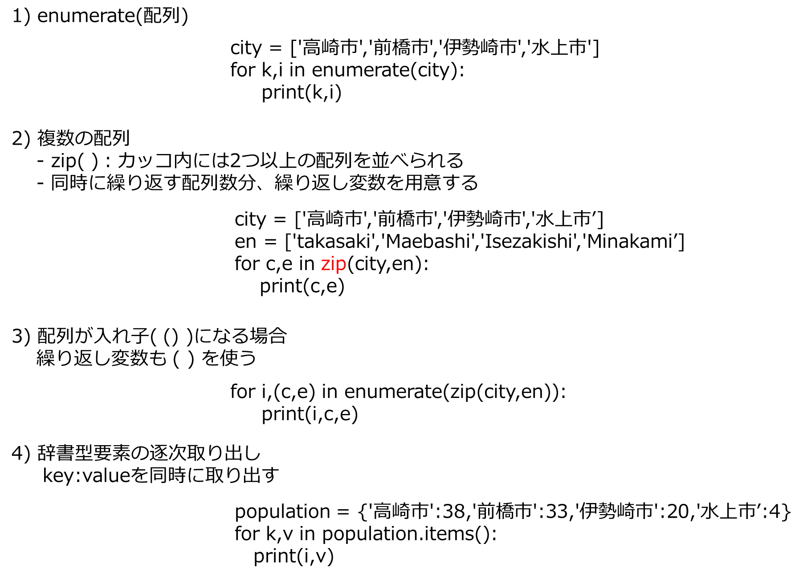
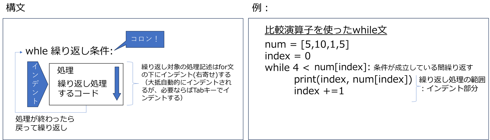

# 繰り返し制御2

# 3. 複数配列を同時に繰り返し処理するfor文
#### 同時に繰り返し変数(for    in に挟まる変数)を記述する




**4) 文字列の配列の繰り返し**  
- enumerate() : 通し番号
- for k,i in のように2つの変数が入ることに注意
  


```python
city = ['高崎市','前橋市','伊勢崎市','水上市']
for k,i in enumerate(city): 
    print(k,i)
```

    0 高崎市
    1 前橋市
    2 伊勢崎市
    3 水上市
    

**5) 辞書型の繰り返し処理**
enumerateを使うときは、for i, (k,v) in のように　( )が挟まる


```python

population = {'高崎市':38,'前橋市':33,'伊勢崎市':20,'水上市':4}
for k,v in population.items(): 
    print(i,v)

for i,(k,v) in enumerate(population.items()): 
    print(i,v)
```

    水上市 38
    水上市 33
    水上市 20
    水上市 4
    0 38
    1 33
    2 20
    3 4
    

**6) 複数配列の同時繰り返し**
enumerateを使うときは、for i, (c,e) in のように　( )が挟まる


```python
city = ['高崎市','前橋市','伊勢崎市','水上市']
en = ['takasaki','Maebashi','Isezakishi','Minakami']
for c,e in zip(city,en): 
    print(c,e)

for i,(c,e) in enumerate(zip(city,en)): 
    print(i,c,e)

```

    高崎市 takasaki
    前橋市 Maebashi
    伊勢崎市 Isezakishi
    水上市 Minakami
    0 高崎市 takasaki
    1 前橋市 Maebashi
    2 伊勢崎市 Isezakishi
    3 水上市 Minakami
    

# 演習2
1. 以下の3つの配列の要素を同時に逐次表示せよ(for   in zip(  を使う）
2. for i in range(4)を使って、上記と同じ結果を得よ
```
gunma=['高崎市','前橋市','伊勢崎市','水上市']
saitama=['さいたま市','川越市','熊谷市','秩父市']
tokyo=['立川市','武蔵野市','日野市','八王子市','三鷹']
```


```python

```

    立川市 さいたま市 高崎市
    武蔵野市 川越市 前橋市
    日野市 熊谷市 伊勢崎市
    八王子市 秩父市 水上市
    立川市 さいたま市 さいたま市
    武蔵野市 川越市 川越市
    日野市 熊谷市 熊谷市
    八王子市 秩父市 秩父市
    

3. 以下のリスト型の要素を同時に取り出して、keyが日本語、valueが英語であるような辞書型を作れ

---

city = ['高崎市','前橋市','伊勢崎市','水上市']  
en = ['takasaki','Maebashi','Isezakishi','Minakami']

---


```python

```

    {'高崎市': 'takasaki', '前橋市': 'Maebashi', '伊勢崎市': 'Isezakishi', '水上市': 'Minakami'}
    

4. 以下は埼玉県内の各市の人口の辞書、および世帯数の辞書である。この２つの辞書要素を逐次読んで以下のようなフォーマットで表示せよ  
    表示フォーマット　埼玉県熊谷市　人口:198742　世帯数:77004

```
saitama_dic1 = {'埼玉県川越市':350745,'埼玉県熊谷市':198742,'埼玉県川口市':578112,'埼玉県行田市':82113,'埼玉県秩父市':63555}
saitama_dic2 = {'埼玉県川越市':145715,'埼玉県熊谷市':77004,'埼玉県川口市':245830,'埼玉県行田市':31015,'埼玉県秩父市':24038}
```


```python

```

    埼玉県川越市  人口: 350745  世帯数: 145715
    埼玉県熊谷市  人口: 198742  世帯数: 77004
    埼玉県川口市  人口: 578112  世帯数: 245830
    埼玉県行田市  人口: 82113  世帯数: 31015
    埼玉県秩父市  人口: 63555  世帯数: 24038
    

# 演習4.
1. 以下の2つの辞書型の要素を同時に逐次読み、埼玉県●●市 : 1世帯あたり人数　を要素とする辞書型を作れ
```
人口 saitama_dic1 = {'埼玉県川越市':350745,'埼玉県熊谷市':198742,'埼玉県川口市':578112,'埼玉県行田市':82113,'埼玉県秩父市':63555}
世帯数 saitama_dic2 = {'埼玉県川越市':145715,'埼玉県熊谷市':77004,'埼玉県川口市':245830,'埼玉県行田市':31015,'埼玉県秩父市':24038}
```


```python

```

# 5. while文による繰り返し処理 





```python
num = [5,10,1,5]
index = 0
while 4 <  num[index]:
    print(index, num[index])
    index +=1
```

    0 5
    1 10
    

### 1) 比較演算子とは  
= と　== は全然違う。= は演算子ではない。 == は、+ * と同様に演算子である


```python
a=5
b=7
c=5
print(a==c)
print(a==b)
print(a!=b)
print(a<b)
print(a>b)
print(a==c**2)
```

    True
    False
    True
    True
    False
    False
    

### 2) 比較演算の評価結果がTrueならwhile文を実行する
繰り返し毎に変数numに入る値を想像すること


```python
num = 0
while 5 > num:
    print(num)
    num +=1
```

    0
    1
    2
    3
    4
    

### 3) 無限ループ
終わらないので、■を押して強制終了してください


```python
import time
num = 0
while True:
    print(num)
    num +=1
    time.sleep(1)
```

    0
    1
    2
    3
    4
    


    ---------------------------------------------------------------------------

    KeyboardInterrupt                         Traceback (most recent call last)

    Cell In[2], line 6
          4 print(num)
          5 num +=1
    ----> 6 time.sleep(1)
    

    KeyboardInterrupt: 


5. moji='今日は晴れ'からfor文を使って1文字づつ取り出し、これらの文字をつなげて'今日は晴れ'を再度表示せよ


```python
moji='今日は晴れ'
sentence=''
for m in moji:
    sentence+=m
print(sentence)
```

    今日は晴れ
    

# 演習5.
1. 以下のfor文と同じ処理をwhile文で書け


```python
a = [1,2,3,4,5]
total =0
for i in a:
    total+=i
print(total)
    
```

    15
    


```python
a = [1,2,3,4,5]
total =0

```

    15
    

2. 以下のコーディングで、gunmaの要素のうち、'前橋市','伊勢崎市','水上市'のみ逐次取り出して表示するプログラムを完成させよ(for文、while文の2通りでかけ


```python
gunma=['高崎市','前橋市','伊勢崎市','水上市']


```


