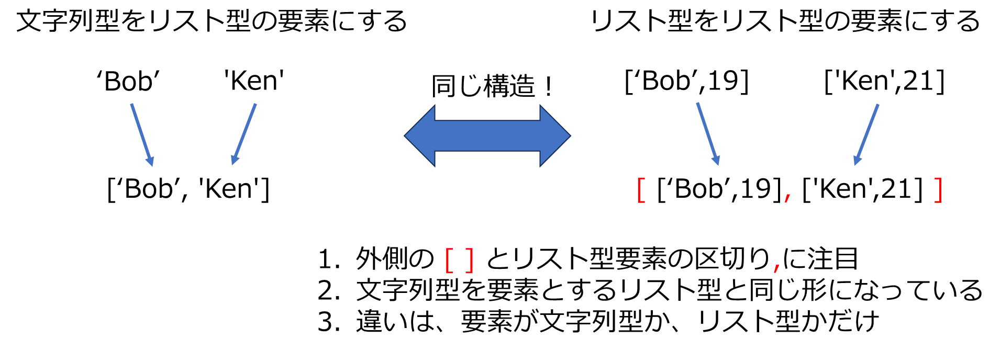

# リスト型の復習


## 演習1
上記の例 namesをコーディングせよ

# リスト型の要素
1. 今までは、数値、文字列のいずれかが要素であるようなリスト型を扱ってきた。
2. 実は、リスト型の要素はどのようなデータ型もOK　。。。データ型　：　数値（整数型、実数型）、文字列、リスト型、辞書型
3. リスト型を要素にするようなリスト型とは？


```python
names = ['Bob','Ken','Alice','Kate','Allen']
```

これは、名前を要素とするリスト型。では、名前と年齢のリスト型を要素とするリスト型を作ってみる
1. 名前と年齢を要素とするリスト型を2つ作ってみる
2.この２つのリストを要素とするようなリスト型を作ってみる


```python
b = ['Bob',19]
k = ['Ken',21]
print(b,k)
```

    ['Bob', 19] ['Ken', 21]
    


```python
bk = [['Bob',19], ['Ken',21]]
print(bk)
bk = [b,k] # これでも同じ
print(bk)
```

    [['Bob', 19], ['Ken', 21]]
    [['Bob', 19], ['Ken', 21]]
    



# 演習2
1. 'Bob','Ken','Alice','Kate','Allen'の各名前に適当に年齢をペアにしたリスト型を作成し、それらのリスト型を要素とするようなリスト型を作れ
2. 同様に、名前、年齢、国籍を要素とするリスト型を要素とするリスト型を作成せよ

# 重要
### 1. 上記のように、リスト型を要素に持つようなリスト型のことを2次元配列のリスト型と呼ぶ。
### 2. 一般に、配列型を要素とする配列型を2次元配列と呼ぶ。

**階層型辞書は2次元配列だった**

---  
        {さいたま市 : { 大宮区:人口, 北区:人口　...}, 東京都: {文京区:人口, 練馬区:人口...}}  
---

**リスト型をvalueとする辞書型も2次元配列**

---  
        {さいたま市 : { 大宮区:[人口,世帯数], 北区:[人口,世帯数]　...} }  
---

# 2次元配列リスト型の操作
### 1. 要素の追加


# 演習3
1. 上記の例、names_ageの要素を追加する例をコーディングしてみよ
2. 演習2.2で作成したリスト型（名前，年齢，国籍のリスト型を要素とするリスト型）に　'Susan' 25 'England' を要素とするリスト型を追加せよ


```python

```

### 2. for文による要素の取り出し
2次元配列リスト型の要素はリスト型なので、for文の繰り返しの都度、リスト型が取り出される。


```python
names = ['Bob', 'Ken', 'Alice']
for n in names:
    print(n)
```

    Bob
    Ken
    Alice
    


```python
names_age = [ ['Bob',19], ['Ken',21], ['Alice',20] ]
for na in names_age:
    print(na)

```

    ['Bob', 19]
    ['Ken', 21]
    ['Alice', 20]
    

# 演習4
以下の2つのリスト型の要素をfor文で同時に取り出して、['Bob',19]のようにリスト型を作り、空のリスト型names_ageに追加せよ。これで上記と同じ2次元配列ができればOK（ヒントzipを使う）


```python
names = ['Bob','Ken','Alice' ]
age = [19,21,20]


```

    [['Bob', 19], ['Ken', 21], ['Alice', 20]]
    

参考（空のリスト型への要素追加）


```python
alphabet = 'abcdefg'
empty = []
for i in alphabet:
    empty.append(i)
print(empty)
```

    ['a', 'b', 'c', 'd', 'e', 'f', 'g']
    

### 3. 2次元配列と2重のfor文
以下2重のfor文になっている。内側のfor文はインデントしていることに注意  
#### **for文のネスト（入れ子）と呼ばれる**


```python
names_age = [ ['Bob',19], ['Ken',21], ['Alice',20] ]
for na in names_age:
    print(na)
    for k in na:
        print(k)

```

    ['Bob', 19]
    Bob
    19
    ['Ken', 21]
    Ken
    21
    ['Alice', 20]
    Alice
    20
    


```python
names_age = [ ['Bob',19], ['Ken',21], ['Alice',20] ]
for na in names_age:
    print(na)
    for k in na:
        print(k)

```

    ['Bob', 19]
    Bob
    19
    ['Ken', 21]
    Ken
    21
    ['Alice', 20]
    Alice
    20
    

# 演習5 
以下のように，名前，年齢，国籍を要素とするリスト型を要素にする2次元配列について, 上例と同様にネストしたfor文を使って、名前，年齢，国籍を１つ1つ表示せよ


```python
profiles = [['Alice',20,'England'],['Bob',19,'United States'],['Shohei',29,'Japan'],['Mamiko',28,'Japan']]
```

# 少し時間をかけて以下の問題をどうコーディングするか考えてみよう
#### ネストしたfor文だけでは対応できそうにないことが理解できるだろうか
1. 上記の名前と年齢の2次元配列 names_ageについて、年齢の平均を計算したい
2. 上記の名前、年齢、国籍の2次元配列 profilesについて、国籍がJapanの年齢の平均を計算したい


# 演習6.
1. 以下はindexを使って年齢だけを取り出すコーディング
- これを修正して、年齢の平均を計算できるように完成せよ


```python
names_age = [ ['Bob',19], ['Ken',21], ['Alice',20] ]
for na in names_age:
    print(na[1])
```

    19
    21
    20
    

2. 同じくindexを使って、国籍がJapanの人の年齢の平均を計算するコーディングを書け


```python
profiles = [['Alice',20,'England'],['Bob',19,'United States'],['Shohei',29,'Japan'],['Mamiko',28,'Japan']]
age = 0
counter = 0

```

    28.5
    

# 2次元配列リスト型は2重のindexが付与されている


# 演習7
1. 上記の2次元配列リスト型から、indexを使って、['Shohei',29,'Japan']を取り出して表示せよ
2. 更に、'Shohei'を取り出せ
3. 演習6 の1.をindexだけを使って同じ結果が得られるようにコーディングせよ


```python

```

    20.0
    

# 総合演習

1. 以下のように要素が、名前 身長 体重 年齢 国籍　であるような２次元配列リストを作成せよ  
   Alice 170 60 20 England    
   Bob 185 75 19 United States  
   Shohei 192 85 30 Japan  
   Mamiko 183 75 28 Japan
   
4. 以下のリストを1.に追加せよ  
   Paul 185 80 31 France
5. 上記2.の2次元配列からindexを使って以下の要素を取り出せ。
   - Shohei 192 85 30 Japan
   - Maimko
6. 年齢の平均値を求めよ


```python

```

    [['Alice', 170, 60, 20, 'England'], ['Bob', 185, 75, 19, 'United States'], ['Shohei', 192, 85, 30, 'Japan'], ['Mamiko', 183, 75, 28, 'Japan']]
    [['Alice', 170, 60, 20, 'England'], ['Bob', 185, 75, 19, 'United States'], ['Shohei', 192, 85, 30, 'Japan'], ['Mamiko', 183, 75, 28, 'Japan'], ['Paul', 185, 80, 31, 'France']]
    ['Shohei', 192, 85, 30, 'Japan']
    Mamiko
    25.6
    

# 重要


```python

```
